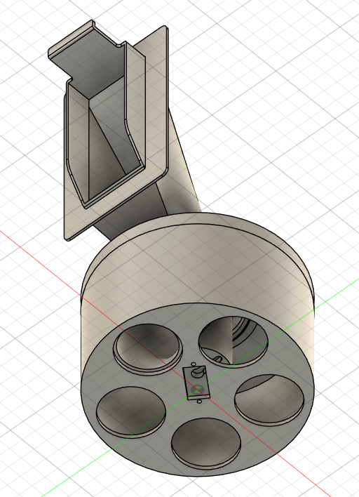

# Regain3D (Archived)

Reduce 3D-printing purge waste and improve multi-material workflows. Regain3D is a monorepo that brings together a desktop app, firmware, and a provisioning mobile app to detect filament changes, inject smarter G-code, and route "pure" vs "mixed" purge material using ESP-controlled valves.

Status: This repository is pre-release and archived. Development stopped due to industry shifts toward multi-head architectures and nozzle-swap systems that reduce or eliminate "purge poop".

Note: The code contains known bugs and incomplete pipelines. Treat this as a reference implementation.

## High-Level Architecture and Flow

- An ESP module controls a servo-actuated waste pipe and acts as the coordinator.
- Users receive an ESP flashed with a provisioning image. Using the mobile app, they set Wi-Fi credentials via BLE.
- Because Flutter lacks robust native mesh BLE, the firmware implements a "mesh-like" behavior: once an ESP is online, it periodically discovers peers and helps provision them, so users do not need to repeat Wi-Fi entry for each device.
- In the desktop app (Electron), users add printers and their connection details.
- After an ESP connects to Wi-Fi, it waits for assignment from Electron. On assignment, based on the printer model, the ESP fetches or is flashed (OTA, second partition) with the relevant driver needed to communicate with the printer.
- For printing, users can run the Electron G-code tool or the CLI (invoking the app with a `.gcode` path). The G-code is optimized for waste reduction and, where needed, injected with ESP-readable commands.
- During a print, the ESP polls or subscribes to printer status, tracks state, and reacts to injected commands and telemetry by updating the waste routing valves (and, where applicable, safe printer actions).
- The dashboard was intended to evolve into a management UI for printer farms.

## Project Goals

- Minimize purge waste during filament changes by splitting purge into two or three stages and routing material accordingly.
- Provide a printer-agnostic desktop app with first-class Bambu LAN support and an extensible driver model for other vendors.
- Provision and manage fleets of ESP32 controllers (discovery, assignment, OTA, health) with consistent APIs.
- Offer a clean, modern UI for farms managing many printers and controllers.

## Repository Layout

- `app/` — Electron + React desktop application (TypeScript)
- `firmware/` — ESP32 firmware (PlatformIO/C++)
- `phone/` — Flutter provisioning app (BLE + onboarding)
- `app/resources/printerConfigs/` — Built-in printer profiles (e.g., Bambu)
- `docs/` — Design notes, specs, and plans.

## What's Working

- Desktop app boots with dashboard and device flows.
- Bambu printer driver (LAN): mDNS discovery, TLS MQTT connection, telemetry mapping, basic commands.
- ESP fleet tools: mDNS + network scan discovery, status polling, assignment wiring, OTA entry points.
- Native TypeScript G-code engine: parses, analyzes, and injects two-stage purging based on printer profiles.
- CLI mode for processing `.gcode` with proper exit codes for slicer integration.

## Known Issues

- ESP discovery is intermittent and may miss devices on some networks; status can appear "offline" even when reachable.
- The G-code injector is profile-driven and currently focuses on Bambu; other vendors need profiles and validation.
- Heartbeat cadence/thresholds and telemetry are incomplete in places (structure and functionality).
- G-code injection and parsing are not finalized. Bambu Lab does not publish full command documentation; several commands require further testing.

## How It Works (High Level)

- The desktop app maintains printers and ESP controllers in a local SQLite DB and communicates with printers via drivers (Bambu first).
- The G-code engine detects filament changes, calculates pure vs mixed purge amounts using printer profiles, and injects commands (for example, `M117 ESP32:...`) to coordinate with ESPs.
- ESPs route purge material using user-defined mapping and report heartbeats/telemetry. Provisioning and OTA flows are coordinated from the desktop app and the Flutter app.

## Getting Started

Prerequisites

- Node.js 18+ and npm
- PlatformIO (VS Code extension or CLI) for firmware
- Flutter (stable channel) for the mobile app

### Desktop App (Electron)

1) Install dependencies

```
cd app
npm install
```

2) Run in development

```
npm run dev
```

The app opens the dashboard. Developer tools open in dev mode.

### CLI G-code Processing

Process a `.gcode` file headlessly (exits 0 on success, 1 on failure or cancellation):

```
cd app
npm run cli -- path/to/input.gcode [--profile <profileId>]
```

Outputs an `_optimized.gcode` file alongside the input and a JSON report by default.

### Firmware (ESP32)

- Open `firmware/` in VS Code with PlatformIO.
- Select the appropriate environment in `platformio.ini` and build/flash.
- The provisioning image exposes BLE onboarding and a minimal HTTP API; the application image handles routing, telemetry, and heartbeats.

### Mobile App (Flutter)

```
cd phone
flutter pub get
flutter run
```

The app scans for ESPs over BLE and assists with onboarding. It targets devices with Regain3D ecosystem tokens.

## Contributing

You are welcome to fork, clone, modify, and redistribute. The project is not supported beyond this point as its utility appears limited for future printer architectures.

## Legal

Regain3D is not affiliated with Bambu Lab or other printer vendors. Use at your own risk and verify behavior before production use.

## Screenshots

- Desktop dashboard

  

- Mobile provisioning (sample screens)

  
  

- Pipe and servo construction
  
  
  
  
  
